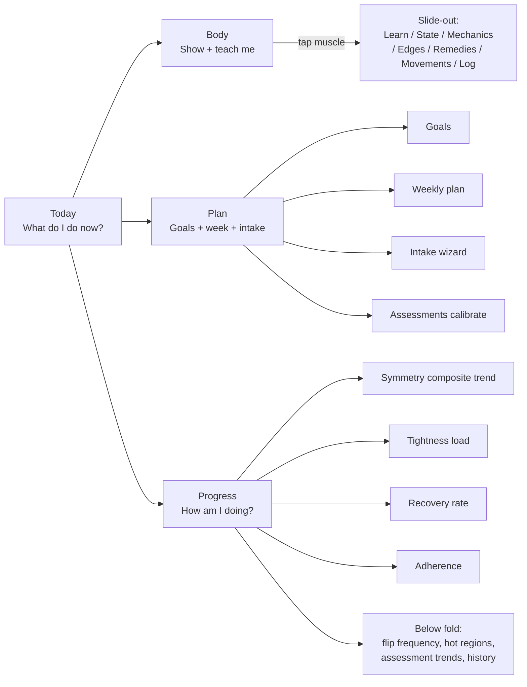

# Stage 02-A — UX foundation plan

> **Status:** Draft v1 — produced 2026-04-16.
> **Scope:** Design spec only. No application code is written in this stage.
> **Implementation handoff:** Stage 02-A.5 executes ticket-by-ticket. Stage 02-B re-opens metrics implementation against the new shell.

Top-level index for the eight Stage 02-A specs. Deep-dives live in:
- [`design-tokens.md`](./design-tokens.md)
- [`screens.md`](./screens.md)
- [`learn-layer-spec.md`](./learn-layer-spec.md)
- [`gamification-spec.md`](./gamification-spec.md)
- [`onboarding-flow.md`](./onboarding-flow.md)
- [`schema-delta.md`](./schema-delta.md)
- [`decisions.md`](./decisions.md)

References used:
- [`../references/current-ux-audit.md`](../references/current-ux-audit.md) — what's wrong today, file + line cited
- [`../references/legacy-ia-map.md`](../references/legacy-ia-map.md) — re-shelving inventory

---

## 1. Executive summary

- **Why this stage exists.** The user's diagnosis: *"When I spin up this app I have no idea what to do, where to go, how it works and how it helps me keep track of my success. It's also very bland and ugly. It also doesn't teach me anything about my body."* Three structural failures (navigation, visual language, education) plus an absent reward loop.
- **The fix is a UX foundation, not a polish pass.** Re-shelve the IA from data-types to user-jobs, encode a real design-token system, add a teaching layer in-context to every muscle, and engineer a calm reward loop. Tier 2 ambition (per [`decisions.md`](./decisions.md) #2).
- **Stage 02 implementation pauses.** All Stage 02 metrics planning stays valid; F1-F9 will land directly into the new Progress screen as Stage 02-B.
- **One single primitive change to the user mental model.** The four tabs become Today / Body / Plan / Progress — each a user job, not a database table.
- **One hero per screen.** Today gets the Body Balance Score (a derived 0-100 number from Stage 02 metrics). Body gets the atlas. Plan gets this-week + goals. Progress gets the symmetry composite trend.
- **Teaching is in-context.** Every muscle slide-out opens with a Learn tab written in plain language, sourced from existing L0/L1/L3 data. No more clinical reference sheets in the user's primary path.
- **Calm gamification.** Body Balance Score + daily streak + milestones (incl. per-region mastery). No XP, no leaderboards, no notifications, no "you're at risk" copy ever.
- **Schema impact: minimal.** Three tiny additions to the Stage 02 v3 blob (`streak`, `milestones`, `onboarding`). No schema-version bump.

---

## 2. Design principles

These five principles trump any spec detail. If a U1-U8 implementer hits a question not covered by the spec files, fall back to these.

1. **One hero per screen.** Every top-tab has exactly one focal point above the fold. Three supporting cards max. Everything else is below the fold.
2. **User job over data type.** Don't make the user translate "I want to fix my tight hip" into "I should open the Log tab." Tabs are jobs.
3. **Teach in-context, never up-front.** No "documentation" surface. The Learn layer surfaces only when a user is looking at a specific muscle.
4. **Reward effort, never punish absence.** Streaks save themselves. Milestones celebrate, then leave. No tier ever calls a user "weak" or "at risk."
5. **Educational, never medical.** The CONVENTIONS §1 disclaimer governs every word of copy. If a phrase reads like a clinic, rewrite it.

---

## 3. Information architecture (the new four tabs)



Old-to-new mapping (full inventory in [`../references/legacy-ia-map.md`](../references/legacy-ia-map.md)):

- `log` -> Today (quick-log shortcut) + Body (in-context log when muscle selected)
- `dashboard` -> Progress (mostly) + Today (hero rolls up from Stage 02 metrics)
- `assessments` -> Plan (input/calibrate) + Progress (trend)
- `planner` -> Today (today's session) + Plan (week + intake) + Progress (symmetry view)

---

## 4. Screen wireframes (summary)

Full text wireframes in [`screens.md`](./screens.md). Summary table:

| Screen | Hero | Above-the-fold supporting cards | Below the fold |
|--------|------|--------------------------------|----------------|
| Today | Body Balance Score (Stage 02 metrics derived) | Today's Session, Hot Regions | Recent activity |
| Body | Anatomical atlas (existing `MuscleAtlas`) | (none — atlas is the screen) | Region overview, Region mastery |
| Plan | This Week strip | Your Goals | Calibrate (assessments + intake re-run) |
| Progress | Symmetry composite trend (30-day) | Tightness load, Recovery rate, Adherence rate | All other Stage 02 metric widgets, accordion |

Plus:
- **Muscle slide-out** (Body screen child): seven sub-tabs in order — Learn, State, Mechanics, Edges, Remedies, Movements, Log.
- **Settings drawer** (overflow menu, all screens): Atlas defaults, Tracking opts, Onboarding replay, Data (export/import/report), About.
- **Global header** (all screens): logo, streak pill, score chip, overflow menu.

---

## 5. Visual language summary

Full token system in [`design-tokens.md`](./design-tokens.md). Summary:

- **Palette:** zinc neutrals + refined teal brand (replaces cyan) + semantic state palette (amber for tight, indigo for weak, soft teal for balanced). No clinical traffic-light reds/yellows/greens.
- **Type scale:** Inter; 11/12/14/16/20/28/40 with 600 for headings.
- **Spacing scale:** 4-base; reuse only the published tokens.
- **Radius:** 6/10/14/20/full.
- **Motion:** 150ms color, 200ms tab/button, 400ms entrance, 800ms celebration. Honors `prefers-reduced-motion`.
- **Iconography:** `lucide-react`. New dependency in U1.
- **Empty states:** standardized icon + headline + supporting line + primary CTA pattern.

---

## 6. Learn layer summary

Full content model and copywriting style guide in [`learn-layer-spec.md`](./learn-layer-spec.md). Summary:

- Every muscle gets a Learn record with: plain-language description, what-it-does bullets, when-it-acts-up (tight/weak), how-to-test prompt, and an optional goal hook.
- Auto-generated from `muscle-mechanics.js` + `relationship-edges.js` + `remedies.js` via templates. Hand-tuned overrides in a small `LEARN_OVERRIDES` for the highest-traffic muscles.
- Style guide: second person, calm tone, short sentences, forbidden words list (no "diagnose", "treat", "should", etc.), required first-mention-defines-the-term.

---

## 7. Gamification summary

Full mechanics in [`gamification-spec.md`](./gamification-spec.md). Three mechanics:

1. **Body Balance Score (0-100)** — derived from Stage 02 M3/M4/M6/M7 with weights `{symmetry: 0.4, tightness: 0.3, recovery: 0.2, adherence: 0.1}`. Tier labels: Recovering / Building / Balanced / Resilient. Cold-start defaults to 50 ("Calibrating").
2. **Daily streak** — consecutive days with at least one meaningful action. Header pill, streak-save grace, no nags.
3. **Milestones** (incl. per-region mastery) — named one-time achievements. Catalog in spec §3. Toast celebration; auto-dismiss; respects reduced motion.

Friction guarantees (no XP, no leaderboards, no notifications, no scary tier names) in [`gamification-spec.md`](./gamification-spec.md) §5.

---

## 8. Onboarding summary

Full flow in [`onboarding-flow.md`](./onboarding-flow.md). Six steps:

1. Welcome + educational disclaimer
2. 30-second body model tour (six layers visualized)
3. Intent picker (4 cards: tight-area / balance-training / rehab / learn)
4. Quick intake (existing intake wizard, framing biased by intent)
5. Suggested first goal (logic biased by intent + flag state)
6. "You're set" + nav to Today

Plus: dismissable per-tab tour overlays first time the user visits each top tab.

---

## 9. Data model additions

Full diff in [`schema-delta.md`](./schema-delta.md). Three additions to the Stage 02 v3 blob, no version bump:

```diff
+ "streak":     { "current": 0, "longest": 0, "lastActiveDate": null }
+ "milestones": [ { "id": "first-flip", "achievedAt": "ISO" } ]
+ "onboarding": { "completedAt": null, "intent": null, "tourSeen": {} }
```

Migration is additive; defensive defaults applied on load.

---

## 10. Work breakdown — U1 to U8

Each ticket follows: Purpose / Inputs / Acceptance / Effort (S/M/L) / Risk / Dependencies. These execute in **Stage 02-A.5 (implementation)**, not in this stage.

### U1 — Tailwind theme + design tokens encoded

- **Purpose.** Land the visual language so every later ticket draws from the same tokens.
- **Inputs.** [`design-tokens.md`](./design-tokens.md), [`bodymap-app/tailwind.config.js`](../../../bodymap-app/tailwind.config.js).
- **Acceptance.**
  - `theme.extend` includes the full color, radius, fontSize, transition tokens from [`design-tokens.md`](./design-tokens.md) §Tailwind config preview.
  - `lucide-react` added as a dependency.
  - Cyan replaced with brand teal across [`bodymap-app/src/BodyMapApp.jsx`](../../../bodymap-app/src/BodyMapApp.jsx) tab styling (lines 609-633) and atlas view buttons (lines 642-654).
  - `npx vite build` passes.
- **Effort.** M. **Risk.** Low. **Dependencies.** None.

### U2 — New nav shell (Today / Body / Plan / Progress)

- **Purpose.** Re-shelve current tabs into the four user-job tabs without rebuilding any panel content yet.
- **Inputs.** [`screens.md`](./screens.md) global header + bottom nav sections, [`../references/legacy-ia-map.md`](../references/legacy-ia-map.md) re-shelving map.
- **Acceptance.**
  - New shell components: `TodayScreen.jsx`, `BodyScreen.jsx`, `PlanScreen.jsx`, `ProgressScreen.jsx`. Each is a stub that imports the relevant existing content.
  - Bottom nav (mobile) + top tabs (desktop) wired with the four tabs.
  - Default landing tab is Today.
  - Header shows logo + (placeholder) streak pill + (placeholder) score chip + overflow.
  - `npx vite build` passes; existing flows still reachable via the new tabs (no functional regression).
- **Effort.** M. **Risk.** Low. **Dependencies.** U1.

### U3 — Today screen with Body Balance Score hero

- **Purpose.** Ship the Today screen with the hero Body Balance Score, today's session card, and hot regions card.
- **Inputs.** [`screens.md`](./screens.md) Today section, [`gamification-spec.md`](./gamification-spec.md) §1, [`stages/02-tracking-metrics/output/plan.md`](../../02-tracking-metrics/output/plan.md) §2 (M3/M4/M6/M7).
- **Acceptance.**
  - `BodyBalanceScore.jsx` renders the 0-100 number, gradient bar with marker, tier label, trend marker, breakdown chip row.
  - Cold-start (no data) shows `50` "Calibrating" with subtitle copy.
  - Today's session card pulls from `SessionPlanner`'s session-plan logic; "Start session" CTA navigates appropriately.
  - Hot regions card renders Stage 02 M5 output; tapping a row deep-links to that muscle on Body.
  - Empty state per [`screens.md`](./screens.md) Today empty-state spec.
- **Effort.** L. **Risk.** Med. **Dependencies.** U1, U2. Requires Stage 02 F1+F2 minimum (or a deterministic fixture so Today renders before Stage 02-B).

### U4 — Body screen + muscle slide-out (Learn layer ships here)

- **Purpose.** Replace the Log tab's bundled side panel with a focused, slide-out muscle detail surface. Learn layer is the default sub-tab.
- **Inputs.** [`screens.md`](./screens.md) Body + slide-out sections, [`learn-layer-spec.md`](./learn-layer-spec.md), all existing L0-L5 panel components.
- **Acceptance.**
  - Body screen renders `MuscleAtlas` full-bleed with state-color heat (amber/indigo/teal).
  - Tapping a muscle opens `MuscleSlideOut.jsx` with seven sub-tabs in order: Learn, State, Mechanics, Edges, Remedies, Movements, Log.
  - Learn sub-tab renders auto-generated content for every muscle; `LEARN_OVERRIDES` populated for at least 10 high-traffic muscles.
  - Mechanics/Edges/Movements sub-tabs show plain-language summary on top with the existing dense panel collapsed by default.
  - Remedies sub-tab includes the adherence checkbox per remedy (consumes Stage 02 F6 schema).
  - Log sub-tab pre-fills `originRegion` to the selected muscle.
  - Slide-out is bottom-anchored on mobile (drag to dismiss), right-anchored on desktop.
- **Effort.** L. **Risk.** Med. **Dependencies.** U1, U2.

### U5 — Plan screen

- **Purpose.** Consolidate planner + intake + goals + assessment-calibration into one job-shaped screen.
- **Inputs.** [`screens.md`](./screens.md) Plan section, [`SessionPlanner.jsx`](../../../bodymap-app/src/SessionPlanner.jsx), assessments form (current `BodyMapApp.jsx` lines 1127-1200).
- **Acceptance.**
  - This Week strip with day badges and a deep link into the weekly plan view.
  - Goals card lists active goals as `GoalCard` (consumes Stage 02 F5 schema). "+ new goal" CTA opens goal create modal.
  - Calibrate section (below fold) hosts assessments form, intake-wizard re-run, lifts/training context update.
  - Existing `IntakeWizard` reused as-is.
- **Effort.** M. **Risk.** Med. **Dependencies.** U1, U2.

### U6 — Progress screen (Stage 02 metrics widgets land here)

- **Purpose.** New shell + slot definitions for every Stage 02 metric widget. The widgets themselves get implemented in Stage 02-B's F3 / F7 / F8 — but their visual home is defined here.
- **Inputs.** [`screens.md`](./screens.md) Progress section, [`stages/02-tracking-metrics/output/plan.md`](../../02-tracking-metrics/output/plan.md) §2.
- **Acceptance.**
  - Hero slot: symmetry composite trend with window selector (7/30/90).
  - Three above-the-fold supporting cards: tightness load, recovery rate, adherence rate.
  - Below-fold accordion with stub slots for hot regions, flip frequency, assessment trends, state-change timeline, patterns, history.
  - Each slot's component contract is documented inline so Stage 02-B knows exactly what to drop in.
  - Empty state per [`screens.md`](./screens.md) Progress empty-state spec.
- **Effort.** M. **Risk.** Med. **Dependencies.** U1, U2.

### U7 — Onboarding flow + per-tab tour overlays

- **Purpose.** Make first-run obvious; teach the four-tab IA via tiny one-step overlays.
- **Inputs.** [`onboarding-flow.md`](./onboarding-flow.md).
- **Acceptance.**
  - Six-step `OnboardingFlow` modal renders when `onboarding.completedAt === null`.
  - Each step navigates / skips / persists per the spec.
  - Step 5 suggested-goal logic produces the correct suggestion for all four intents and the no-flag edge case.
  - Per-tab tour overlays fire once each, anchored as specified.
  - Settings -> Onboarding replay paths work.
  - Reduced-motion + keyboard nav verified.
- **Effort.** M. **Risk.** Med. **Dependencies.** U2 (nav shell exists), U3-U6 (screens to anchor overlays to).

### U8 — Gamification: streak, milestones, region mastery, schema delta migration

- **Purpose.** Wire the reward loop. Persist streak + milestones + onboarding state. Ship `MilestoneToast`.
- **Inputs.** [`gamification-spec.md`](./gamification-spec.md), [`schema-delta.md`](./schema-delta.md).
- **Acceptance.**
  - `recordActivity()` helper called from every meaningful-action handler; streak update logic correct for `last === today / yesterday / older / null`.
  - Streak save grace UI works when missed days <= 2.
  - All milestones in `gamification-spec.md` §3 catalog fire exactly once and persist.
  - Region mastery levels transition correctly; level-up fires the appropriate milestone.
  - `MilestoneToast` auto-dismisses; respects reduced motion; haptic on mobile.
  - Schema delta migration applied: `streak`, `milestones`, `onboarding` initialized for v2-or-missing blobs.
  - All new fields round-trip through export/import.
  - `_config/storage-schema.md` updated to reflect the full v3 shape (consolidates Stage 02 F9's planned doc update).
- **Effort.** M. **Risk.** Low. **Dependencies.** U2, U7. Plays nicely with Stage 02 F1 (which also touches the migration code).

---

## 11. Phased roadmap

Each phase is demoable. Phases sized for the user to feel progress after each one.

| Phase | Tickets | Demoable milestone | Exit criteria |
|-------|---------|--------------------|---------------|
| **U-Phase 0: Tokens + nav shell** | U1, U2 | New visual language across the app; four-tab IA reachable; existing content still works inside new tabs | Build passes; cyan replaced; bottom nav functional on mobile; no regression in existing flows |
| **U-Phase 1: Today + Body** | U3, U4 | User opens app -> sees Body Balance Score -> taps muscle on Body -> reads Learn tab; in-context log works | Today renders for cold-start and populated user; Learn auto-generation covers all muscles; 10+ overrides seeded |
| **U-Phase 2: Plan + Progress shells** | U5, U6 | User can see week + goals + calibration in one place; Progress screen exists with empty slots ready for Stage 02-B | All four screens functional end-to-end; Progress slot contracts documented inline for Stage 02-B |
| **U-Phase 3: Onboarding + gamification** | U7, U8 | Brand-new user gets the wizard; daily activity builds streak; first-flip and first-goal milestones fire | Onboarding flow complete; streak + milestones + region mastery wired; all new fields round-trip |
| **Hand-off to Stage 02-B** | (next stage) | Stage 02 F1-F9 metrics widgets drop into the U6 slots | Stage 02 plan §5 phases F-Phase 0 to F-Phase 4 execute as originally planned, against the new shell |

---

## 12. Open decisions

All structural and downstream decisions are confirmed. Full table + rationale in [`decisions.md`](./decisions.md). Summary:

| # | Decision | Confirmed answer |
|---|----------|------------------|
| 1 | Sequencing vs Stage 02 | UX-first; pause Stage 02; resume as 02-B |
| 2 | Ambition tier | Tier 2 — onboarding + IA + Learn + medium gamification + visual refresh |
| 3 | New IA structure | Today / Body / Plan / Progress |
| 4 | Color palette direction | Zinc + refined teal + semantic state (amber/indigo/balanced-teal) |
| 5 | Hero number identity | Body Balance Score (0-100, derived) |
| 6 | Gamification depth | Score + streak + milestones (incl. region mastery). No XP/leaderboards/notifications. |
| 7 | Learn layer source | Auto-generated from L0/L1/L3 + small `LEARN_OVERRIDES` |
| 8 | Onboarding intent picker | Four intents — tight-area, balance-training, rehab, learn |
| 9 | Schema bump for UX | None — additive fields inside Stage 02 v3 blob |
| 10 | Atlas component reuse | Reused unchanged; re-styled via tokens |
| 11 | Logo / brand identity | Defer; refresh tagline only |

---

## 13. First three concrete tickets (paste-ready for Stage 02-A.5 kickoff)

Ready-to-execute tickets for U-Phase 0 and the start of U-Phase 1. Each has 3 acceptance criteria.

### U1 — Tailwind theme + design tokens

- [ ] Add the [`design-tokens.md`](./design-tokens.md) §Tailwind config preview to [`bodymap-app/tailwind.config.js`](../../../bodymap-app/tailwind.config.js) `theme.extend`. Add `lucide-react` to dependencies.
- [ ] Replace cyan utility classes with brand teal across [`bodymap-app/src/BodyMapApp.jsx`](../../../bodymap-app/src/BodyMapApp.jsx) (tab pill styling lines 609-612, view buttons lines 642-654, "Log Again" button line 676, mobile menu styling). No remaining `cyan-*` class outside the atlas overlay logic.
- [ ] `npx vite build` passes; visual smoke test confirms the four tabs read in teal not cyan, no broken styling, dark theme intact.

### U2 — New nav shell (Today / Body / Plan / Progress)

- [ ] Create `bodymap-app/src/TodayScreen.jsx`, `BodyScreen.jsx`, `PlanScreen.jsx`, `ProgressScreen.jsx` as stubs. Each imports the existing tab content from `BodyMapApp.jsx` per the re-shelving map in [`../references/legacy-ia-map.md`](../references/legacy-ia-map.md). No new functionality yet — just relocation.
- [ ] Replace the four-pill tab row (`BodyMapApp.jsx` lines 620-633) with a top-tabs component on desktop and a bottom-fixed nav on mobile, both showing Today / Body / Plan / Progress. Default landing tab is Today.
- [ ] Header includes logo + placeholder streak pill (renders `—` for now) + placeholder score chip (renders `—` for now) + overflow menu icon. `npx vite build` passes; every previously-reachable feature is still reachable through the new tabs (no functional regression).

### U3 — Today screen + Body Balance Score hero (cold-start path)

- [ ] Implement `BodyBalanceScore.jsx` per [`gamification-spec.md`](./gamification-spec.md) §1. Cold-start (no `stateChanges`) renders `50` with "Calibrating" tier label and the subtitle copy.
- [ ] Today screen includes: hero Body Balance Score, Today's Session card (rendered from `SessionPlanner`'s session logic, "Start session" CTA), Hot Regions card (consumes Stage 02 M5 — use a deterministic fixture if Stage 02 F1+F2 isn't merged yet).
- [ ] Empty-state copy + CTA per [`screens.md`](./screens.md) Today empty-state spec when no data exists. `npx vite build` passes; manual smoke test on a fresh-localStorage browser shows the hero and empty-state correctly.

---

## 14. What this stage explicitly does NOT do

- No code edits — implementation is Stage 02-A.5.
- No custom illustration system, no marketing landing page, no rebranding (Tier 3, deferred).
- No backend, no accounts, no sync.
- No re-derivation of Stage 02 metrics — gamification reuses them.
- No new schema version (additions are additive inside the Stage 02 v3 blob).
- No internationalization, no light mode, no full WCAG audit (scoped out per [`decisions.md`](./decisions.md) §Deferred).

---

## Appendix — Files Stage 02-A.5 will touch

Reference map for the implementation session.

| Area | File | Change |
|------|------|--------|
| Design tokens | [`bodymap-app/tailwind.config.js`](../../../bodymap-app/tailwind.config.js) | `theme.extend` per [`design-tokens.md`](./design-tokens.md) |
| Dependency | `bodymap-app/package.json` | Add `lucide-react` |
| Shell | [`bodymap-app/src/BodyMapApp.jsx`](../../../bodymap-app/src/BodyMapApp.jsx) | Replace tab nav, route into new screens, add header chips, settings drawer trigger |
| Screens (new) | `bodymap-app/src/TodayScreen.jsx`, `BodyScreen.jsx`, `PlanScreen.jsx`, `ProgressScreen.jsx` | New shells |
| Slide-out (new) | `bodymap-app/src/MuscleSlideOut.jsx` | Body screen child |
| Learn (new) | `bodymap-app/src/LearnPanel.jsx`, `bodymap-app/src/data/learn-overrides.js`, `bodymap-app/src/data/action-verbs.js` | Learn sub-tab + content sources |
| Gamification (new) | `bodymap-app/src/BodyBalanceScore.jsx`, `StreakBadge.jsx`, `MilestoneToast.jsx`, `bodymap-app/src/data/milestones.js`, `bodymap-app/src/lib/recordActivity.js` | Score + streak + milestone wiring |
| Onboarding (new) | `bodymap-app/src/OnboardingFlow.jsx`, `bodymap-app/src/lib/suggestFirstGoal.js` | Six-step wizard + per-tab tours |
| Settings (new) | `bodymap-app/src/SettingsDrawer.jsx` | Overflow menu home for export/import/report + opts |
| Re-skinned panels | [`bodymap-app/src/MuscleStatePanel.jsx`](../../../bodymap-app/src/MuscleStatePanel.jsx), [`MuscleMechanicsPanel.jsx`](../../../bodymap-app/src/MuscleMechanicsPanel.jsx), [`RelationshipEdgesPanel.jsx`](../../../bodymap-app/src/RelationshipEdgesPanel.jsx), [`RemedyPanel.jsx`](../../../bodymap-app/src/RemedyPanel.jsx), [`MovementRecruitmentPanel.jsx`](../../../bodymap-app/src/MovementRecruitmentPanel.jsx) | Token replacement + plain-language wrapper above the dense panel |
| Storage docs | [`_config/storage-schema.md`](../../../_config/storage-schema.md) | Full v3 shape including `streak`, `milestones`, `onboarding` (consolidated with Stage 02 F9 update) |
| Stage completion | `stages/02a-ux-foundation/output/completion-log.md` (new in Stage 02-A.5) | Mirror v1 completion-log format |
